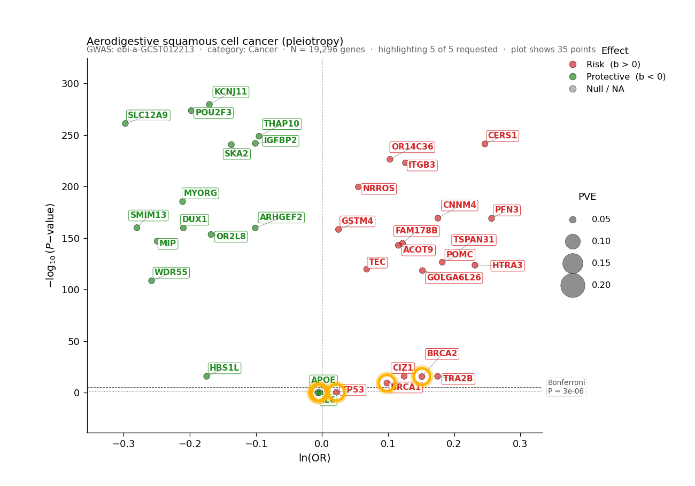
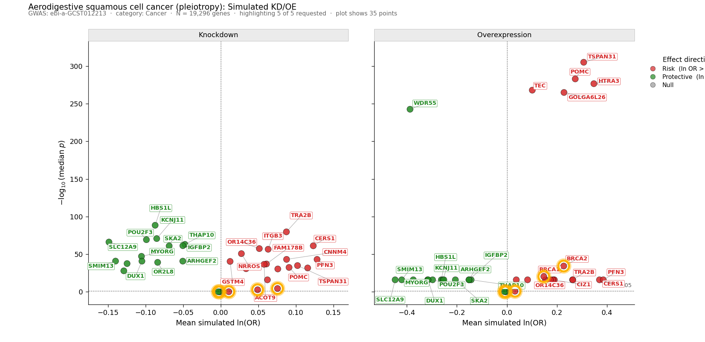

# 🧬 Virtual KO/OE Disease Atlas

**AI-powered causal simulation of human gene perturbation across diseases**

> Pre-computed Mendelian Randomization across **19,296 human genes × 374 GWAS diseases** = **7.22 million pairs**.
> Pick a disease + a gene (or paste a list / upload a CSV) → instantly see the causal effect + simulated knockdown/overexpression.

---

## ▶️ Run it now — zero install

🔗 **https://is.gd/virtual_gene_atlas**

No login. No download. No GPU. Works on phone or desktop. ~1 second per search.

---

## 📚 What's in this repo

This is a **documentation-only repo**. The app, code, and pre-computed data live on the live Hugging Face Space:
🔗 **https://huggingface.co/spaces/jianlizhao/GeneDisease-MR-Browser**

This repo contains the **guides** you need to:

| File | Use it when you want to … |
|------|----------------------------|
| **[RUN.md](RUN.md)** | … learn the three ways to use or deploy the app (live / local / your-own-HF-Space) |
| **[INTERPRETATION.md](INTERPRETATION.md)** | … *deeply* understand every figure element, every disease metadata field, what each number means |
| **[ATLAS.md](ATLAS.md)** | … cite or share the app — public-facing description |
| **[WORKFLOW.md](WORKFLOW.md)** | … rebuild a similar gene–disease GWAS app (reusable recipe for other projects) |
| **[DEPLOY.md](DEPLOY.md)** | … push your own copy to Hugging Face Spaces (LFS, secrets, gotchas) |

---

## 🖼️ Sample outputs

### MR Volcano plot
Every gene = one dot. **🟢 Green = protective**, **🔴 Red = risk**, **size = strength of instrument**. Dashed lines mark P = 0.05 and Bonferroni thresholds. Your queried gene gets an **orange ring**.

### KD/OE simulation
Two side-by-side panels: **Knockdown** (what happens if you inhibit the gene) and **Overexpression** (what happens if you boost it). Color tells you the therapeutic outcome at a glance — green panels = lower disease risk under that perturbation.

> 👉 To fully decode these plots — every dot, color, ring, line, label, and CSV column — see **[INTERPRETATION.md](INTERPRETATION.md)**.

---

## ✨ Key features

- **Pre-computed at scale** — 7.2 M gene × disease MR pairs ready instantly
- **Three input modes** — single gene, pasted list, or CSV upload
- **Disease metadata panel** — auto-shows population, sample size, ancestry, cases/controls, PubMed + GWAS-Catalog + OpenGWAS links
- **Volcano + faceted KD/OE simulation** — publication-style ggplot2-look figures with biological-meaning legends
- **Threshold annotations** — labeled `P = 0.05` and Bonferroni lines so non-statisticians can read it
- **Downloads** — every figure + CSV
- **Mobile-friendly** — works on a phone

---

## 🔬 Data sources

- **Genes** — [HGNC](https://www.genenames.org/) complete set (19,296 protein-coding)
- **Diseases** — [EBI GWAS Catalog](https://www.ebi.ac.uk/gwas/) (filtered to 374 from 89,981 studies)
- **MR methodology** — [TwoSampleMR](https://mrcieu.github.io/TwoSampleMR/) (Inverse-Variance-Weighted)
- **GWAS summary statistics** — [OpenGWAS](https://gwas.mrcieu.ac.uk)

---

## 📖 Citation

If you use this tool in published work, please cite:

- **TwoSampleMR** — Bowden et al. (2015). *Eur J Epidemiol.* doi:[10.1007/s10654-015-0011-z](https://doi.org/10.1007/s10654-015-0011-z)
- **OpenGWAS** — Elsworth et al. (2020). *Genome Med.* doi:[10.1186/s13073-020-0714-9](https://doi.org/10.1186/s13073-020-0714-9)
- **GWAS Catalog** — Sollis et al. (2023). *Nucleic Acids Research.* doi:[10.1093/nar/gkac1010](https://doi.org/10.1093/nar/gkac1010)

---

## 📄 License

Apache 2.0 — see [LICENSE](LICENSE).

## 🤝 Feedback

Bug reports & feature requests welcome via this repo's Issues. For app behavior, you can also use the Hugging Face Space's Discussions tab.

---

| | |
|---|---|
| **Live app** | https://is.gd/virtual_gene_atlas |
| **HF Space** (code + data) | https://huggingface.co/spaces/jianlizhao/GeneDisease-MR-Browser |
| **Author** | [@jianlizhao](https://huggingface.co/jianlizhao) ([@jimmyuab](https://github.com/jimmyuab) on GitHub) |
| **Last updated** | 2026-05-11 |
